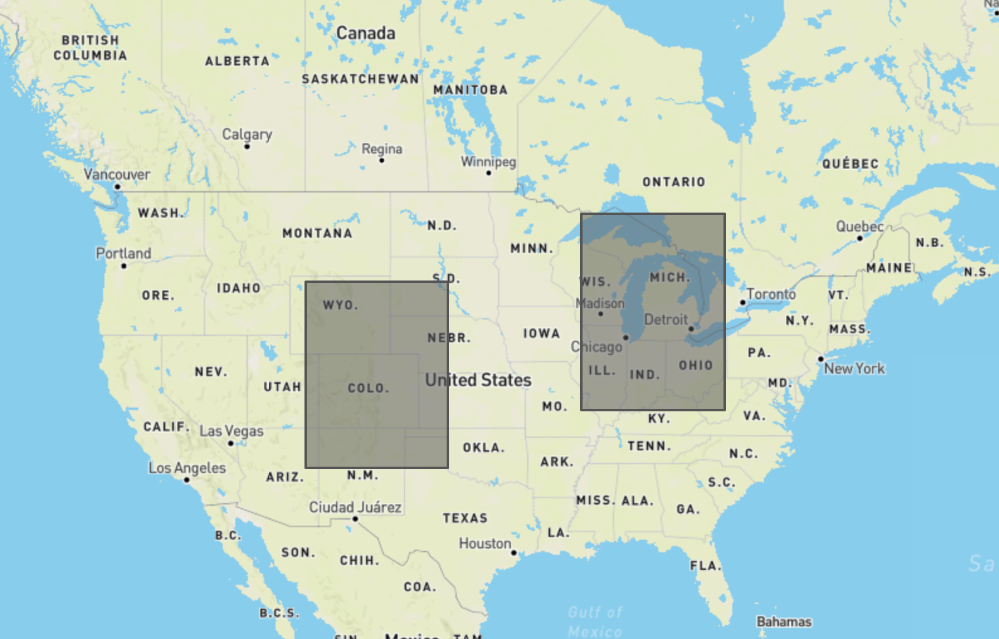
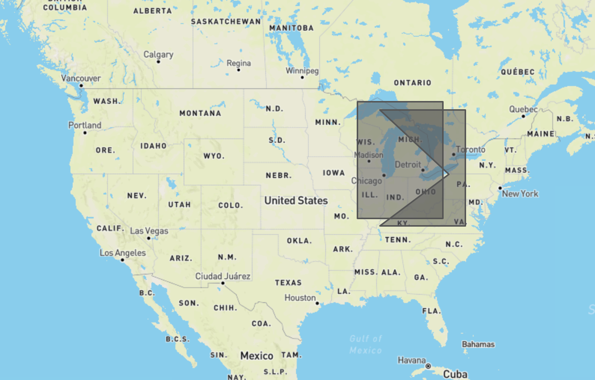

# MaxarCodeChallenge

## Summary

This is the source code needed to deploy a RestAPI using AWS native services that meets the requirements below. I did not automate the doployent of this code, but the deployment process is described below.

## Requirements

Problem:
Create a REST API, with a single resource, that accepts an HTTP POST method request with two GeoJSON polygon objects. 
This should returns a Boolean value indicating whether the provided objects spatially intersect one another.
 
Requirements:
- All requests and responses must be valid JSON
- The completed challenge must be pushed to GitHub (github.com) for review during onsite interview
- Include relevant documentation for the running and testing of the applicationNote:
- Try and write the application in Python if possible and use open source libraries to your advantage!
- It’s ok if you are unable to complete the challenge, but at minimum be prepared to discuss possible implementation steps during onsite interview.
 
Guidance:
- This should take less than 4 hrs to complete (although, you can take up to a week to send back your solution)
- We're not looking for perfection, but rather a framework to hold a discussion about your thoughts on design, implementation, library selection, etc...
- If you're taking more time than expected: add skeleton code, comments, etc... to support that discussion.

## Summary of Files

|Folder|Description|
|---|---|
|/|Code related to repository managment|
|/MaxarCodeChallenge|Code related to the all resources of the RestApi application|
|/MaxarCodeChallenge/jsonCompare.py|Lambda function code that comparse two GeoJSON objects|
|/MaxarCodeChallenge/CloudformationTemplates|Code that is used to generate the AWS infrastructure needed to deploy RestAPI|

## Deployment Steps
1. Build jsonCompare Lambda deployment package on Amazon Linux 2 EC2 instance (lambda runs on Amazon Linux EC2 and deployment package needs to be compiled on the same hardware)
 
   1. Launch EC2 instance
   2. Establish a connection with EC2 instance
   3. Copy jsonCompare.py to the EC2 instance
   4. Zip jsonComapre.py and its dependencies to a .zip file

2. Ececute the MaxarCodeChallengeDeploymentBucket.json Cloudformation Template to make a bucket to hold jsonCompare lambda deployment package
4. Copy the jsonCompare lambda deployment package to the newly created bucket
5. Execute the MaxarCodeChallengeApiDeployment.json Cloudformation Tempate to create RestAPI and Lambda funciton infrastructe
6. Pull the apiEndpoint form the MaxarCodeChallengeApiDeployment stack output
7. Send POST request to apiEndpioint. Body will be one json object containing two GeoJson polygon objects

## Testing

### No Intersection

test
`https apigatewayendpoint/polygon_intersect < grapids_denver.json`

response
`{"PolygonsIntersect": false}`

### Intersection

test
`https apigatewayendpoint/polygon_intersect < grapids_detroit.json`

response
`{"PolygonsIntersect": true}`

## Future Work

1. Automate the deployment process
2. Provide automatice documentation of python methods using Sphinx
3. Review IAM permission to ensure least privilage
